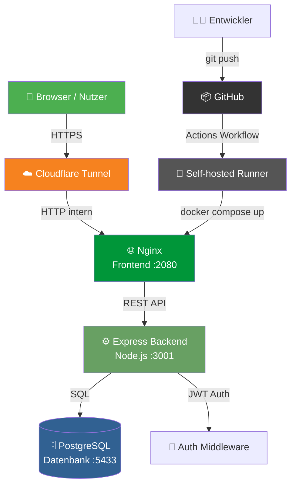

# School Plan - Kids

Ein kinderfreundlicher, digitaler Vertretungsplan für Grundschulen.

> 📓 Genaue Projektbeschreibung und Dokumentation: [OneDrive](https://1drv.ms/o/c/e6ac48a3da56b972/IgAKDFkQRBeKSoejBImcJV-wAU5PoULeaOFgqXc0LstRbqA?e=YMVJEd)

[](https://leo-kunstsk.riccardorohling.com/#/login)


## 🌐 Live Demo

**➡️ [https://leo-kunstsk.riccardorohling.com/#/login](https://leo-kunstsk.riccardorohling.com/#/login)**

Die Demo läuft auf einem echten Server (Cloudflare Tunnel + Docker). Login-Daten in [ANMELDEDATEN.md](ANMELDEDATEN.md).

> ⚠️ **Hinweis:** Dies ist eine reine Demonstrationsversion mit fiktiven Testdaten. Alle Passwörter sind öffentlich bekannt – nicht für echten Schulbetrieb geeignet.

---

## 📋 Übersicht

School Plan Kids ist eine moderne Web-Anwendung für Grundschulen, die Schülern, Eltern, Lehrern und Administratoren einen einfachen Zugang zu Stundenplänen, Vertretungen und Schulneuigkeiten bietet.

### ✨ Hauptfunktionen

#### 📚 Für Schüler
- Eigenen Stundenplan einsehen
- Vertretungen erkennen (mit "V"-Badge)
- Neuigkeiten der Schule lesen
- Kinderfreundliches, buntes Design

#### 👨‍👩‍👧 Für Eltern
- Stundenpläne aller Kinder einsehen
- Schulneuigkeiten und Elternabende
- Krankschreibungen online einreichen
- Termine im Überblick

#### 👨‍🏫 Für Lehrer
- Eigenen Stundenplan anzeigen
- Stundenpläne von Kollegen einsehen
- Pausenaufsichten erkennen
- Termine für Klassen/Eltern ankündigen
- Unterrichtsinhalte dokumentieren
- Eigene Krankmeldung einreichen

#### ⚙️ Für Administratoren
- Alle Stundenpläne überwachen und bearbeiten
- Benutzer verwalten (Schüler, Eltern, Lehrer)
- Krankmeldungen einsehen und bestätigen
- Unterrichtsinhalte einsehen
- Vertretungen erstellen

## 🚀 Installation

### Voraussetzungen

- [Docker](https://www.docker.com/get-started) (Version 20+)
- [Docker Compose](https://docs.docker.com/compose/install/) (Version 2+)

### Schnellstart

1. **Repository klonen:**
   ```bash
   git clone https://github.com/your-username/school-plan-kids.git
   cd school-plan-kids
   ```

2. **Umgebungsvariablen konfigurieren:**
   ```bash
   cp .env.example .env
   # Bearbeite .env und setze sichere Passwörter!
   ```

3. **Container starten:**
   ```bash
   docker compose up -d
   ```

4. **Anwendung öffnen:**
   - Frontend: http://localhost:2080
   - API: http://localhost:3001/api/health

### Standard-Admin-Login

Nach dem ersten Start wird ein Admin-Benutzer erstellt:
- **E-Mail:** admin@schule.de
- **Passwort:** test1234

> Alle Test-Accounts (Lehrer, Schüler, Eltern) verwenden ebenfalls das Passwort `test1234`. Vollständige Liste in [ANMELDEDATEN.md](ANMELDEDATEN.md).

## 🏗️ Systemarchitektur



### 📁 Dateistruktur

```
.
├── ANMELDEDATEN.md
├── docker-compose.yml
├── trigger_lehrer.py
├── trigger_reset.py
├── backend/
│   ├── Dockerfile
│   ├── package.json
│   ├── test-password.js
│   ├── update-admin-password.js
│   ├── database/
│   │   ├── fix_teacher_conflicts.sql
│   │   ├── init.sql
│   │   ├── seed.sql
│   │   ├── seed2.sql
│   │   └── seed3.sql
│   └── src/
│       ├── server.js
│       ├── config/
│       │   └── database.js
│       ├── middleware/
│       │   └── auth.js
│       └── routes/
│           ├── admin.js
│           ├── auth.js
│           ├── classes.js
│           ├── news.js
│           ├── sickNotes.js
│           ├── timetable.js
│           ├── trigger.js
│           └── users.js
├── frontend/
│   ├── Dockerfile
│   ├── index.html
│   ├── nginx.conf
│   ├── css/
│   │   └── style.css
│   └── js/
│       ├── api.js
│       ├── app.js
│       ├── auth.js
│       ├── components.js
│       ├── router.js
│       └── trigger.js
└── README.md
```

## 🔒 Datenschutz & Sicherheit

School Plan Kids wurde mit besonderem Fokus auf Datenschutz entwickelt:

### Implementierte Maßnahmen

- **Minimale Datenerfassung:** Nur notwendige Daten werden gespeichert
- **Keine Detailpflicht bei Krankmeldungen:** Gründe sind freiwillig
- **Sichere Passwörter:** bcrypt-Hashing mit Salt
- **JWT-Tokens:** HttpOnly Cookies für sichere Session-Verwaltung
- **Rate Limiting:** Schutz vor Brute-Force-Angriffen
- **CORS-Schutz:** Nur autorisierte Ursprünge
- **Security Headers:** Helmet.js für XSS, Clickjacking-Schutz
- **Audit-Log:** Nachvollziehbarkeit von Änderungen
- **Rollenbasierter Zugriff:** Strenge Berechtigungen

### Empfehlungen für den Produktivbetrieb

1. HTTPS aktivieren (SSL-Zertifikat)
2. Sichere Passwörter in .env setzen
3. Regelmäßige Backups der Datenbank
4. Datenschutzerklärung gemäß DSGVO erstellen
5. Einwilligung der Eltern für Kinderdaten einholen

## 🎨 Kinderfreundliches Design

Das Design wurde speziell für Grundschüler entwickelt:

- **Große, lesbare Schriften**
- **Bunte Fachfarben** (Deutsch=Rot, Mathe=Grün, etc.)
- **Emoji-Avatare** statt echter Fotos
- **Einfache Navigation** mit Icons
- **Deutliche Vertretungs-Markierung** ("V"-Badge)
- **Responsive Design** für Tablets und Smartphones

## 📱 Responsive Design

Die Anwendung funktioniert auf:
- 📱 Smartphones
- 📲 Tablets
- 💻 Desktop-Computern

## 🛠️ Entwicklung

### Lokale Entwicklung

```bash
# Alle Container starten
docker compose up -d

# Logs anzeigen
docker compose logs -f

# Einzelnen Container neu starten
docker compose restart backend
```

### Datenbank-Migration

Das Schema wird automatisch beim ersten Start über `init.sql` erstellt, Testdaten über `seed.sql`, `seed2.sql` und `seed3.sql`.

> ⚠️ **Wichtig:** Die Init-Skripte werden von PostgreSQL **nur einmal** ausgeführt, solange das Docker-Volume `postgres_data` existiert. Bei Änderungen an den SQL-Dateien muss das Volume neu erstellt werden:
> ```bash
> docker compose down -v   # Volume löschen (alle Daten gehen verloren)
> docker compose up -d     # Neustart mit frischen Daten
> ```
> Alternativ können Änderungen direkt in die laufende DB eingespielt werden:
> ```bash
> docker exec -i schoolplan-db psql -U schoolplan_user -d schoolplan < backend/database/seed3.sql
> ```

### API-Dokumentation

Die API-Endpunkte sind in den Route-Dateien dokumentiert:

| Endpoint | Methode | Beschreibung |
|----------|---------|--------------|
| `/api/auth/login` | POST | Benutzer-Login |
| `/api/auth/me` | GET | Session prüfen |
| `/api/timetable/my` | GET | Eigener Stundenplan |
| `/api/news` | GET | Neuigkeiten laden |
| `/api/sick-notes/student` | POST | Krankmeldung Kind |
| `/api/admin/users` | GET/POST | Benutzerverwaltung |

## 🤝 Beitragen

Beiträge sind willkommen! Bitte erstelle einen Pull Request.

## 📄 Lizenz

MIT License - siehe [LICENSE](LICENSE)

## 👨‍💻 Autor

Entwickelt mit ❤️ für Grundschulen

---

**Hinweis:** Dieses Projekt ist als Vorlage gedacht und sollte vor dem Produktiveinsatz an die spezifischen Anforderungen der jeweiligen Schule angepasst werden.
